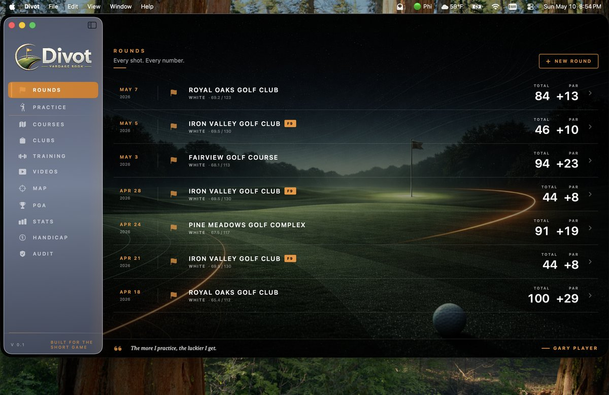
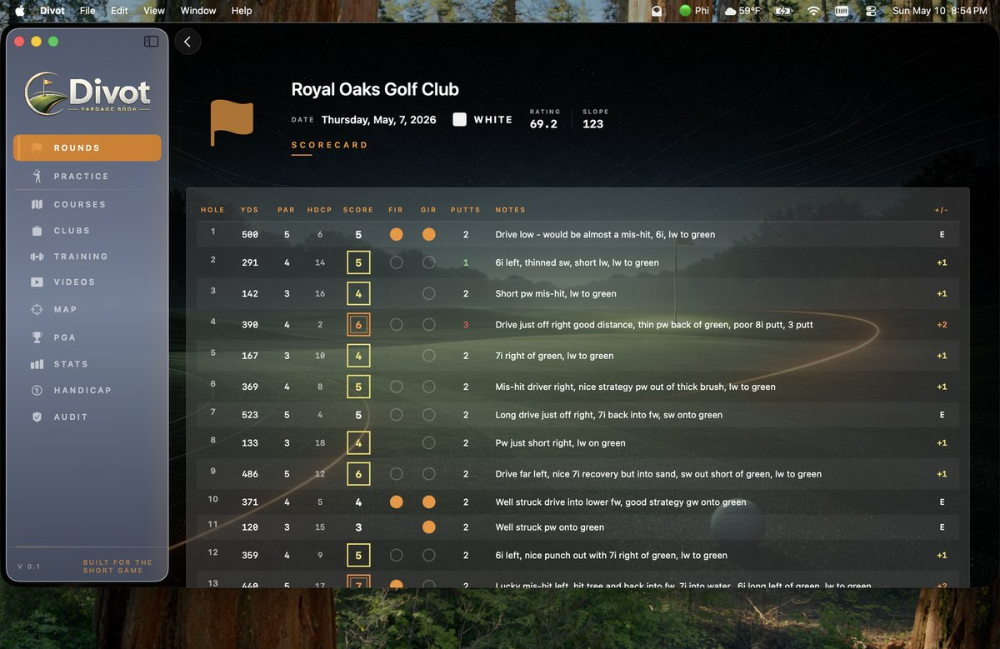
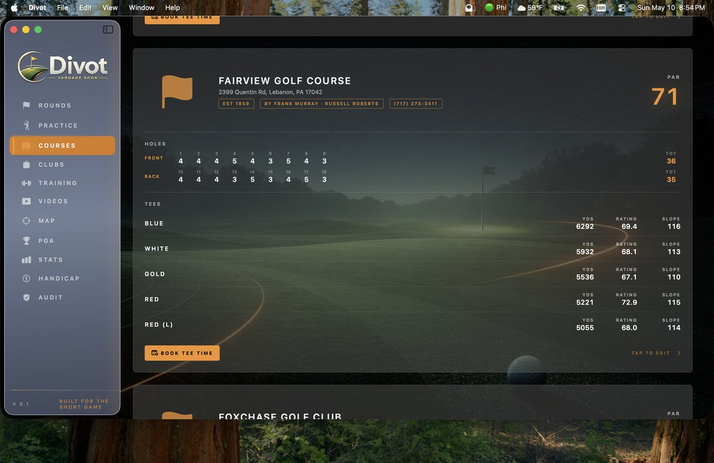
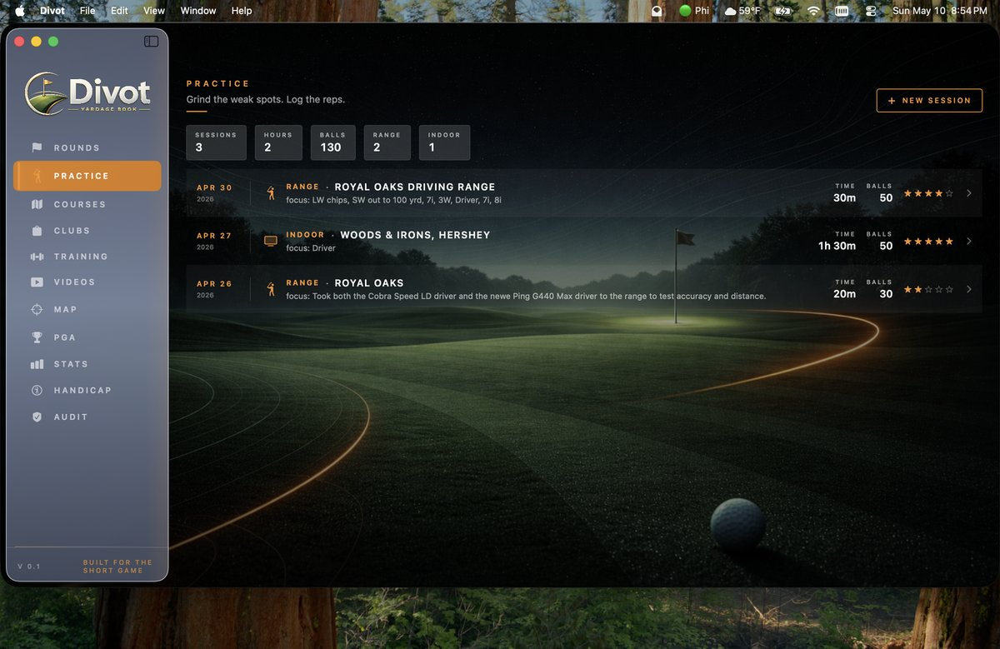
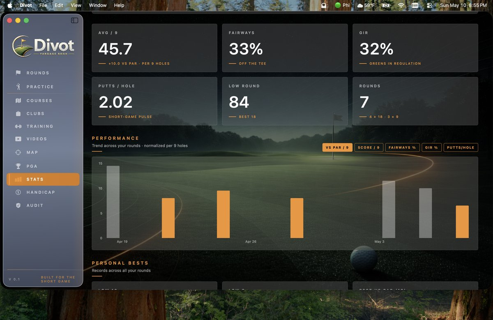
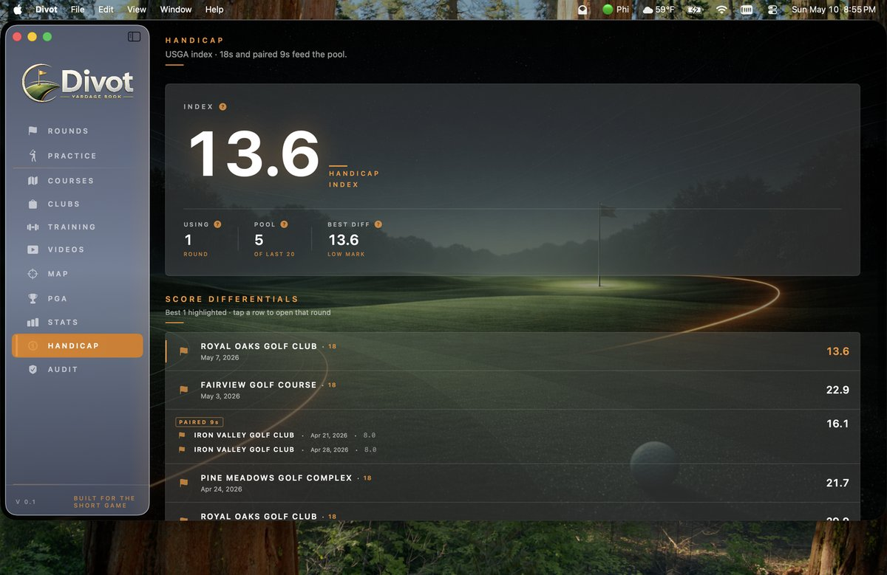
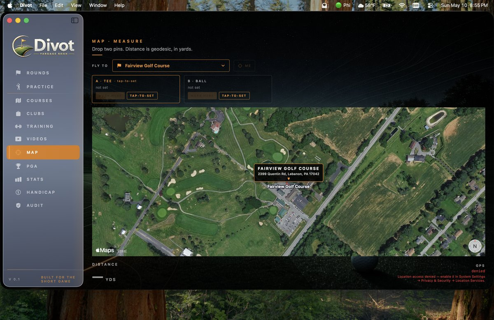
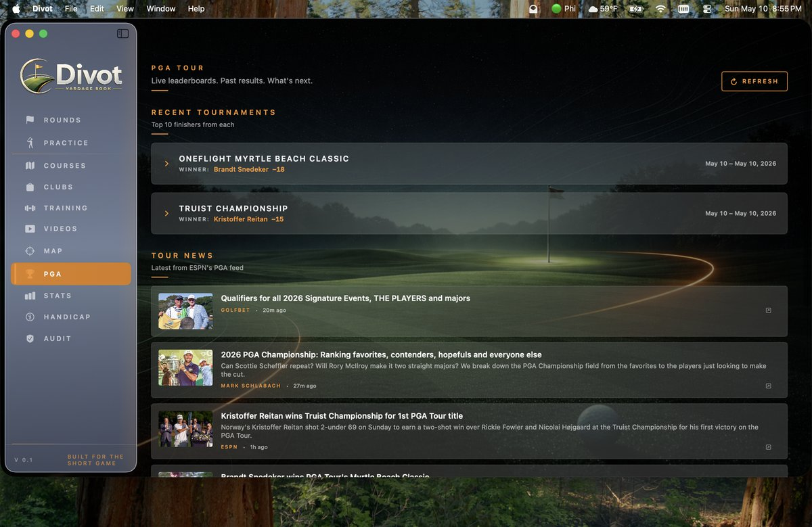
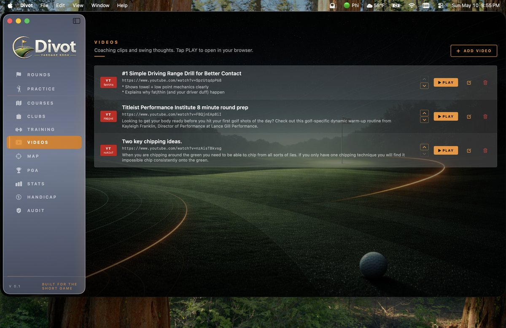
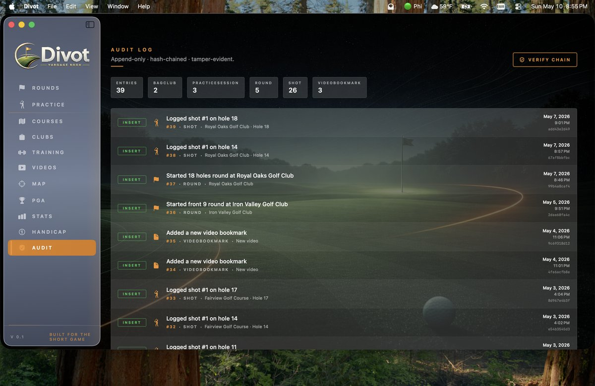

# Divot

A native macOS golf tracker, built in Swift / SwiftUI / SwiftData.

Divot keeps your rounds, shots, courses, clubs, practice notes, video
bookmarks, and a USGA-style handicap index — all local, no cloud sync,
no analytics, no telemetry. The data store lives in the app's sandbox
container and never leaves your machine.



## Screenshots

| | |
|---|---|
| **Rounds** — every round, vs‑par color‑coded, course logos at a glance. | **Scorecard** — pro‑style score marks (circle = under par, square = over), per‑hole notes, fairway / GIR flags, putts colored by count. |
|  |  |
| **Courses** — per‑tee yardages, ratings, and slopes. Tap any tee row to play it. | **Clubs &amp; Practice** — color‑coded bag (driver gold, woods blue, hybrid teal, irons silver, wedge green, putter violet), session log, retire instead of delete. |
|  |  |
| **Stats** — per‑9‑hole averages, performance trend, personal bests, trimmed‑average drive, identity ladder (NOW / ASCEND / DESCEND). | **Handicap** — USGA World Handicap System, paired 9‑hole rounds, best‑N differential pool, small‑pool adjustment, per‑metric explainers. |
|  |  |
| **Map** — MapKit satellite, geocoded fly‑to for any saved course, two‑point geodesic distance measurement in yards. | **PGA** — current tournament leaderboard and news from ESPN + PGA Tour, weather for the host course. Handles team events. |
|  |  |
| **Videos** — bookmark coaching clips, auto‑extracts YouTube IDs, opens in your browser. | **Audit log** — append‑only hash‑chained record of every meaningful write. Tamper‑evident. |
|  |  |

## Features

- **Rounds** — full 18, front 9, or back 9. Per-hole scorecard with par,
  score, putts, fairway / GIR flags, yardage, handicap index, notes.
  Color-coded score marks (eagle / birdie / par / bogey / double / triple).
- **Shot log** — every shot recorded with club, distance, lie, result, notes.
  Drives the longest-drive and trimmed-average-drive stats.
- **Courses** — full course model: per-tee yardages, ratings, slopes;
  per-hole pars and handicap indices. Public build ships empty — the
  user builds their own list. Indoor-simulator venues are flagged
  separately so each round can record which course was loaded.
- **Clubs** — color-coded by category (driver / fairway / hybrid / iron
  set / wedge / putter). Soft-retire keeps history without clutter.
- **Videos** — quick bookmarks for YouTube coaching clips. Tap-to-open
  in your default browser.
- **Map** — MapKit satellite view with two-point geodesic distance
  measurement (CLLocation, USGA-friendly meters → yards). Address-based
  fly-to for any saved course.
- **PGA** — current tournament leaderboard and news (ESPN + PGA Tour
  feeds, on-demand only). Includes Open-Meteo weather for the host
  course. Handles team events (e.g. Zurich Classic).
- **Stats** — averaged per-9-hole scoring (so 9- and 18-hole rounds are
  comparable), fairways / GIR / putts trends, longest drive, trimmed
  average drive, eagles / birdies / pars, best par-or-better streak.
- **Handicap** — USGA World Handicap System: net-double-bogey-capped
  adjusted gross, score differentials, last-20 pool, paired 9-hole
  rounds combined into 18-hole-equivalent entries, best-N average,
  small-pool adjustments (-2.0 / -1.0).
- **Audit log** — every meaningful write (insert, update, retire,
  archive, delete) is captured for traceability.

## Architecture

- **SwiftUI** for all views (no AppKit-bridged UI except where macOS
  needs it — `NSWorkspace.open` for browser hand-off, `NSImage` for
  asset loading).
- **SwiftData** (`@Model`) for persistence. One on-disk store, in the
  app's sandbox `Library/Application Support/`.
- **MapKit** + **CoreLocation** for the Map screen — no JS bridges,
  no WebView.
- **CLGeocoder** for address-to-coordinate refinement on course
  selection.
- A small **TempCleaner** wipes `tmp/`, `Caches/`, and `HTTPStorages/`
  on launch and termination so transient URL caches don't accumulate.

## Building

```bash
brew install xcodegen          # if you don't have it
git clone https://github.com/Sur-92/divot.git
cd divot
xcodegen generate              # writes Divot.xcodeproj from project.yml
open Divot.xcodeproj
```

Then build/run the `Divot` scheme in Xcode. Targets **macOS 14+**.

The first run will:
- Open with an empty bag, an empty courses list, and no rounds —
  everything is yours to build.
- Prompt for Location permission (only used for the Map screen —
  declining doesn't break anything else).

To pre-seed your own private list of courses or clubs on first launch,
drop the data into the stubs in `Divot/Services/CourseSeeder.swift`
and `Divot/Services/ClubCatalogSeeder.swift`.

## Sandbox & entitlements

Minimal by design:

| Entitlement | Why |
|---|---|
| `app-sandbox` | Standard app sandbox |
| `network.client` | PGA / ESPN / Open-Meteo fetches; MapKit tiles |
| `personal-information.location` | Map screen "Mark Here" GPS |
| `files.user-selected.read-only` | Future import of scorecards |

No iCloud entitlement, no contacts, no calendar, no microphone, no
camera, no shared containers, no XPC services, no helper tool.

## License

All Rights Reserved — personal project. See [LICENSE](LICENSE).

## Tooling

This project was built with the assistance of modern AI coding systems, primarily Claude and ChatGPT, which proved valuable for accelerating implementation, exploration, and iteration throughout development. The architecture, direction, tradeoffs, constraints, and final decisions that give the system coherence were guided and directed by me.
